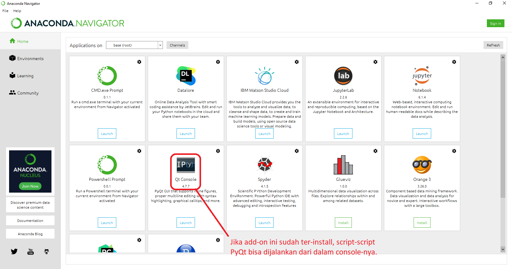

# Tutorial PyQt

PyQt adalah _wrapper_ Qt menggunakan Python. Basisnya adalah Qt, yakni framework untuk _multi-platform programming_ dalam C++. PyQt dibuat oleh Riverbank Computing yang saat ini tersedia dalam beberapa versi, yaitu PyQt4. PyQt5 dan PyQt6. Dalam tutorial ini kita akan menggunakan PyQt5. Wrapper Qt dalam Python sebenarnya ada dua yang populer: PyQt dan PySide. PySide dibuat oleh Nokia (yang kemudian membuat/mengakuisisi Qt Company) dan hampir tidak memiliki perbedaan signifikan dengan PyQt (kecuali lisensi).

## Instalasi

PyQt5 bisa diinstall di beragam platform (Windows,Linux/Mac, Android, dsb) dengan cukup mudah. Untuk bisa menggunakan PyQt5, tentu saja framework Qt5 harus ada di dalam platform tersebut dan akan diinstall secara otomatis ketika PyQt5 diinstall. Berikut adalah cara instalasi PyQt5.

### Instalasi di Windows
Cara instalasi yang paling mudah adalah memanfaatkan pip (baik untuk Python yang diinstall secara native maupun Anaconda):
`pip install PyQt5`

Jika Python diinstall menggunakan Anaconda versi terbaru (misal Anaconda3-2020.11), maka _by default_ PyQt akan sudah terpasang dan siap digunakan. Dalam tutorial ini, akan digunakan PyQt yang sudah tersedia di dalam Anaconda tersebut. _Screenshot_ berikut menunjukkan bahwa PyQt sudah ter-install bersama-sama dengan Anaconda dan siap digunakan.

### Instalasi di Linux
Selain menggunakan pip, cara instalasi PyQt di Linux juga bisa dilakukan beberapa cara (tergantung distro yang digunakan). Contohnya jika menggunakan Debian/Ubuntu, bisa dilakukan dengan cara berikut:
`sudo apt install python3-pyqt5`

### Instalasi di Mac
Hampir mirip dengan cara instalasi di Linux, biasanya (yang sering berhasil dilakukan) adalah:
`brew install pyqt5`

## Add-on

Ada beberapa _library_ lain yang dibutuhkan jika ingin memanfaatkan beberapa fasilitas/add-on dari PyQt. Beberapa akan ditunjukkan ketika tutorial sedang berlangsung.

## That's all!

Happy coding!
